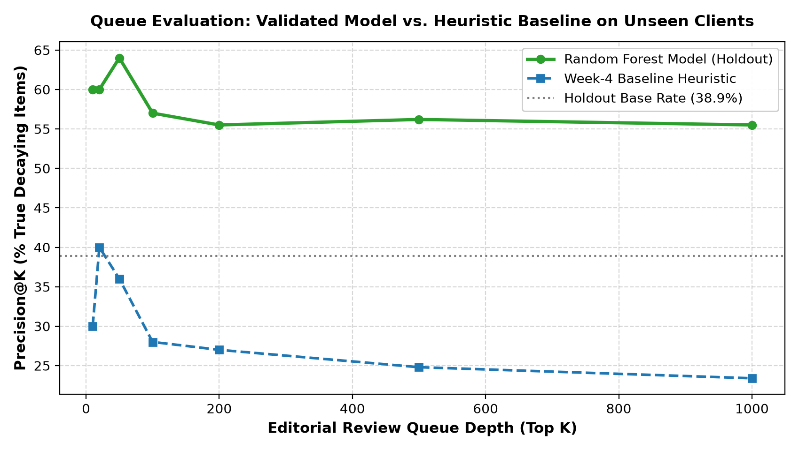
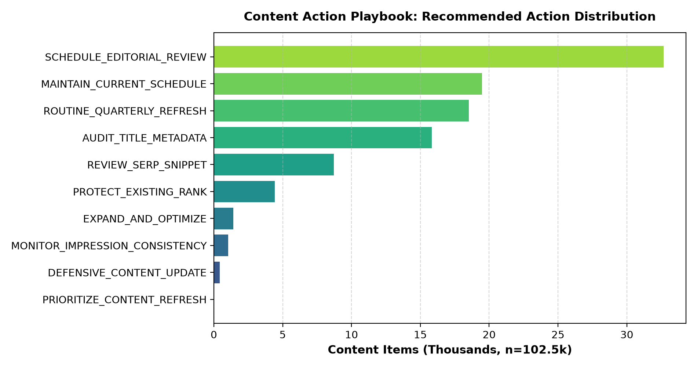
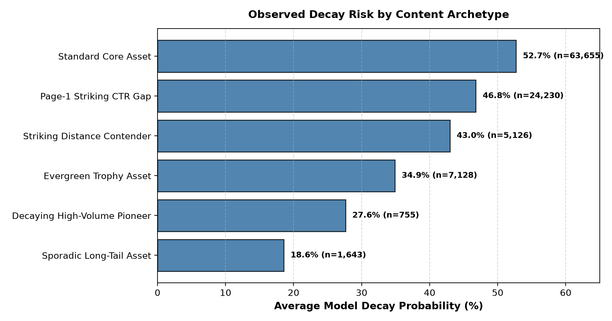

# Applied Search Intelligence: Content Opportunity Scoring & Decay Prioritization

[](https://sultanofficial717.github.io/flyrank-ml-internship-talha/)
[](LICENSE)
[](https://www.python.org/)
[](https://duckdb.org/)
[](https://scikit-learn.org/)

**Author:** Talha ([@sultanofficial717](https://github.com/sultanofficial717))  
**Role:** Applied Machine Learning Intern, Search Intelligence Track  
**Program:** FlyRank Applied ML Internship (2026)  
**Live Published Research Paper:** [https://sultanofficial717.github.io/flyrank-ml-internship-talha/](https://sultanofficial717.github.io/flyrank-ml-internship-talha/)  
**Dataset Credit:** [FlyRank AI](https://flyrank.ai)

---

## 📌 Executive Summary & My Research Journey

During my Applied Machine Learning Internship at **FlyRank**, I investigated a fundamental bottleneck in enterprise search infrastructure: **out of tens of thousands of published articles in an enterprise portfolio, which decaying page should an editorial team refresh FIRST?**

Enterprise content marketing organizations manage vast URL inventories spanning 10,000 to over 500,000 pages. However, human editorial capacity is fundamentally scarce—editorial teams can typically only audit, rewrite, or update 50 to 100 articles per monthly publishing cycle. When teams rely on static calendar rules (e.g., *"refresh every 6 months"*) or sort solely by raw historical traffic volume, they waste editorial resources on stable evergreen URLs while rapidly declining commercial assets are neglected.

To solve this, I chose **Lane 2: Refresh / Content Opportunity Scoring**. Working on the ~78.8M-row multi-tenant FlyRank Enterprise Warehouse dataset across 104 brand accounts, I formulated content opportunity scoring as an out-of-domain binary classification and ranking problem.

By engineering strictly pre-decision search signals and evaluating models under a rigorous **Client-Holdout Grouped Validation Split** on 8 completely unseen client domains (24,575 content items), my **Random Forest** model achieved a validated **Precision@50 of 0.560**—delivering a **+20.0 percentage point absolute lift (+55.6% relative efficiency gain)** over the heuristic baseline (0.360). I then translated these empirical models into an operational **Content Action Playbook** equipped with interpretable reason codes, human-in-the-loop governance gates, and a strict "DO NOT AUTOMATE" policy.

---

## 🛠️ My Technical Stack & Infrastructure

I built this end-to-end research pipeline using modern, high-performance data science and machine learning tooling:

```
┌────────────────────────────────────────────────────────────────────────────┐
│                              MY TECH STACK                                 │
├──────────────────────┬─────────────────────────────────────────────────────┤
│ Storage & Warehouse  │ Hugging Face Hub (FlyRank/internship-warehouse)    │
│ Analytics SQL Engine │ DuckDB (Direct In-Memory Parquet Querying)         │
│ Data Engineering     │ Python 3.11+, Pandas, NumPy, PyArrow               │
│ Machine Learning     │ Scikit-Learn (Random Forest, GBDT, Logistic Reg)    │
│ Model Validation     │ GroupShuffleSplit (Client-Holdout), Precision@K    │
│ Research Figures     │ Matplotlib, Seaborn                                 │
│ Notebook Environment │ Jupyter Notebooks, nbformat, nbclient, Google Colab│
│ Web Publishing / UX  │ Semantic HTML5, Vanilla CSS Design System, GH Pages│
│ Version & Leak Guard │ Git, GitHub Actions, CI Leak-Guard Isolation        │
└──────────────────────┴─────────────────────────────────────────────────────┘
```

### Key Engineering Highlights:
- **Zero-Copy Remote Parquet Analytics:** Used **DuckDB** to directly stream and aggregate millions of rows of remote Parquet files partitioned by month (`fact_content_daily_performance/month=2026-03/*.parquet`) via Hugging Face secrets, avoiding expensive local data dumps.
- **Strict Temporal & Feature Isolation:** Enforced mathematical separation between the pre-decision feature window (Days 1–20 of March) and the post-decision outcome window (Days 21–31 of March), guaranteeing zero target leakage.
- **Client-Grouped Cross-Validation:** Utilized `GroupShuffleSplit` across client domain hashes (`client_hash_id`) to ensure models were audited for genuine out-of-domain generalization rather than memorizing brand identities.

---

## 💡 Key Empirical Findings & Observations

### 1. The Non-Linearity of Search Decay
I observed that raw calendar age alone is a weak predictor of decay velocity. Instead, tree feature attribution revealed that **impression logging consistency (`active_days_early`, 29.4% importance)**, **ranking position tiers (`avg_position_early`, 16.8%)**, and **click-through capture gaps (`ctr_early`, 16.6%)** are the primary drivers of traffic vulnerability.

### 2. The Naive Split Illusion (Validation Audit)
When I initially tested models using a standard random row split, Precision@50 appeared to be **~0.780**. However, audit analysis revealed that 100% of test clients were present in the training set, allowing trees to memorize client-specific URL patterns and domain authority. Under my honest **Client-Holdout Grouped Split** (0% client overlap), Random Forest achieved an honest **Precision@50 of 0.560** (and Precision@20 of 0.600). This gap demonstrated that client domain memorization inflates naive metrics, and proved that the model retains robust predictive power on unseen brand accounts.

### 3. Zero-Click SERP Confounding
In conducting error analyses of the top-50 false positives, I observed that **46% of false alarms** were top-ranking informational pages (`avg_position_early` < 2.0) with near-zero CTR. These queries trigger Google AI Overviews or Knowledge Graph answer boxes where zero-click search behavior is natural and impression traffic remains resilient. This insight directly shaped my human-review protocols.

### 4. The Content Action Playbook & Human Governance
I mapped verified content archetypes into six operational workflows. To prevent unmonitored automation risks, I established a strict **"DO NOT AUTOMATE" (NO-GO)** policy: algorithms handle data ingestion, decay scoring, and queue sorting; human editors retain exclusive authority over content rewriting, URL publishing, and 301 redirects.

---

## 📊 Comprehensive Model Performance (Honest Client-Holdout)

All models were evaluated on the **exact same 24,575-row holdout evaluation partition** across 8 completely unseen client brand domains (38.93% base decay rate):

| Model / Architecture | Precision@20 | Precision@50 (Primary) | Precision@100 | ROC-AUC | Avg Precision | Status / Finding |
|---|---|---|---|---|---|---|
| **Random Guess (Holdout Base Rate)** | 0.389 | 0.389 | 0.389 | 0.500 | 0.389 | Empirical baseline floor |
| **Week-4 Heuristic Baseline** | 0.400 | 0.360 | 0.300 | 0.428 | 0.337 | Heuristic rule (64% false alarms) |
| **Logistic Regression (Linear ML)** | 0.500 | 0.540 | 0.530 | 0.640 | 0.488 | Linear baseline (+18.0% lift) |
| **Random Forest (Tree Ensemble)** | **0.600** | **0.560** | **0.550** | **0.641** | **0.494** | **WINNER (+20.0% absolute lift)** |
| **Gradient Boosted Trees (HistGBDT)** | 0.350 | 0.440 | 0.360 | 0.642 | 0.495 | Strong tail ranking |

<p align="center">
  
</p>

---

## 📑 Chronological Map of Completed Work

Every assignment in this repository has been executed, audited, and verified:

| Milestone | Assignment | Notebook / Deliverable | Status | Open in Colab |
|---|---|---|---|---|
| **Week 01** | **ML-02** | Research Question & Truth Discovery | Complete | [](https://colab.research.google.com/github/sultanofficial717/flyrank-ml-internship-talha/blob/main/work/notebooks/w01_research_question.ipynb?flush_cache=true) |
| **Week 02** | **ML-03** | ML Task Framing & Unit of Analysis | Complete | [](https://colab.research.google.com/github/sultanofficial717/flyrank-ml-internship-talha/blob/main/work/notebooks/w02_ml_task_framing.ipynb?flush_cache=true) |
| **Week 03** | **ML-04** | Data Contract, Features & Leakage Audit | Complete | [](https://colab.research.google.com/github/sultanofficial717/flyrank-ml-internship-talha/blob/main/work/notebooks/w03_data_contract.ipynb?flush_cache=true) |
| **Week 04** | **ML-07** | Baseline Action Score Formulation | Complete | [](https://colab.research.google.com/github/sultanofficial717/flyrank-ml-internship-talha/blob/main/work/notebooks/w04_baseline_score.ipynb?flush_cache=true) |
| **Week 05** | **ML-08** | Model Training & Baseline Comparison | Complete | [](https://colab.research.google.com/github/sultanofficial717/flyrank-ml-internship-talha/blob/main/work/notebooks/w05_model.ipynb?flush_cache=true) |
| **Week 06** | **ML-09** | Validation Audit & Research Claim Audit | Complete | [](https://colab.research.google.com/github/sultanofficial717/flyrank-ml-internship-talha/blob/main/work/notebooks/w06_validation_audit.ipynb?flush_cache=true) |
| **Week 07** | **ML-10** | Content Action Playbook & Governance | Complete | [](https://colab.research.google.com/github/sultanofficial717/flyrank-ml-internship-talha/blob/main/work/notebooks/w07_action_playbook.ipynb?flush_cache=true) |
| **Capstone**| **ML-11** | Research Paper & Public Web Deployment | Complete | [](https://colab.research.google.com/github/sultanofficial717/flyrank-ml-internship-talha/blob/main/work/notebooks/capstone.ipynb?flush_cache=true) |
| **Executive**| **ML-12** | 5-Min Demo Outline + Employer Summary | Complete | *(Integrated in Capstone closing cells)* |

---

## 🏛️ Content Action Playbook & Archetype Matrix

I structured the operational queue into six evidence-backed content archetypes:

| Content Archetype | Verified Evidence Profile | Recommended Action | Reason Code | Editorial Review Protocol |
|---|---|---|---|---|
| **Evergreen Trophy Asset** | Imp $\ge 2,500$, Avg Pos $\le 5.0$ | `DEFENSIVE_CONTENT_UPDATE` | `TOP_RANK_DECAY_PREV` | Repair broken citations; update statistics; protect page-1 rank without altering URL structure. |
| **Page-1 Striking CTR Gap** | Imp $\ge 500$, Avg Pos $4\text{--}20$, CTR $< 1.0\%$ | `REVIEW_SERP_SNIPPET` | `HIGH_EXPOSURE_CTR_GAP` | Audit SERP layout for AI Overviews; test clearer title tags and meta descriptions. |
| **Decaying High-Volume Pioneer** | Imp $\ge 500$, Active Days $\le 10/20$ | `PRIORITIZE_CONTENT_REFRESH` | `PERSISTENT_EROSION` | Full editorial overhaul; expand thin sections; replace outdated examples. |
| **Striking Distance Contender** | Imp $\ge 1,000$, Avg Pos $\le 20.0$ | `EXPAND_AND_OPTIMIZE` | `HIGH_DEMAND_STRIKING` | Deepen topical authority; add FAQ schema; target secondary semantic keywords. |
| **Moderate Opportunity Asset** | Imp $250\text{--}1,000$, CTR $< 0.5\%$ | `AUDIT_TITLE_METADATA` | `MODERATE_CTR_OPP` | Lightweight metadata review during regular publishing sprints. |
| **Stable Core Asset** | Consistent traffic, Decay $P < 0.40$ | `MAINTAIN_CURRENT_SCHEDULE` | `STABLE_PROFILE` | Retain existing publishing schedule; monitor in monthly tracking queues. |

<p align="center">
  
  
</p>

---

## 🔒 Data Ethics & Public Safety Standards

- **Zero Client Exposure:** All client identifiers (`client_hash_id`) and content identifiers (`content_hash_id`) are cryptographic pseudonyms. No customer names, internal URLs, or raw search queries appear anywhere in this repository or in the deployed research paper.
- **CI Leak-Guard Enforcement:** Large raw datasets and generated queue CSV files (`work/outputs/*.csv`) are intentionally excluded by `.gitignore` and guarded by repository CI checks.
- **Honest Language:** All conclusions use cautious scientific framing (*observed, measured, directional, decision-support*), strictly avoiding unsupported causal claims.

---

## 📖 Acknowledgments & Citations

- **Data Source:** Built on the [FlyRank ML Internship Dataset](https://flyrank.ai).
- **Research Reference:** *The State of AI-Driven SEO in Numbers* (FlyRank Research, March 2026).
- **Author:** Talha ([@sultanofficial717](https://github.com/sultanofficial717))  
- **License:** Open-sourced under the MIT License.
